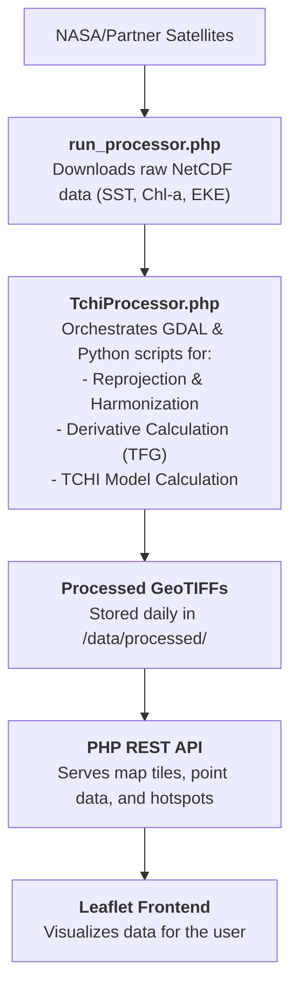

# SharkScope 🦈

🚀 Live Demo: https://bionauts.space/sharkscope

[](https://opensource.org/licenses/MIT)
[](https://www.spaceappschallenge.org/2025/challenges/sharks-from-space/)

**A habitat suitability model and data visualization platform for marine apex predators, built for the NASA Space Apps Challenge 2025.**

> Imagine trying to protect all the birds in the world, but you only have a map of the trees, not a map of where their food is. It would be impossible, right? For decades, that's how we've been trying to protect sharks. We know the oceans they live in, but we don't know where they go for their meals.
>
> **SharkScope changes that forever. We invented a revolutionary new way to create the world's first-ever map of shark "restaurants"**.

---

## 🧪 The Science: Our "Secret Recipe"

Our project is built on one simple, powerful idea: If you can find the food, you can find the shark. To do this, we created a secret recipe with five key "ingredients" that we can see from space using NASA's amazing satellites.

* 🌡️ **The Right Temperature:** We find the "sweet spot" thermal conditions that sharks and their prey are most comfortable in.
* 🌿 **Green, Food-Rich Water:** We look for high concentrations of chlorophyll, which signals the presence of plankton—the base of the entire marine food chain.
* 🧱 **Invisible Ocean "Walls":** We map thermal fronts where warm and cool waters meet, which act as natural barriers that trap smaller fish and create a buffet line.
* 🌀 **Giant Ocean Whirlpools:** We spot huge, swirling eddies that act as giant food traps, creating a pop-up feast in the open ocean.
* 🏔️ **The Shape of the Seafloor:** We use maps of underwater mountains and canyons that are natural, permanent gathering places for fish[.

### The "Weakest Link" Rule: What Makes Our Model Revolutionary

Older methods failed because they couldn't account for a simple truth: a perfect temperature can't make up for an empty pantry. Our model is different. It's built on a **weighted geometric mean**, which enforces a crucial "deal-breaker" rule: if even ONE ingredient is terrible (like the water is freezing, or there is zero food), our system knows the restaurant is closed, and the hotspot disappears from our map. This "weakest link" logic makes our map dramatically more realistic and accurate than anything that has come before.

### The Math Behind the Magic

The Trophic-Cascade Habitat Index (TCHI) is calculated for every pixel on the globe using the following formula, which penalizes any single limiting factor:

$$ TCHI = \prod_{v \in V} S_v^{w_v} \quad \text{where } V = \{SST, Chl\text{-}a, TFG, EKE, Bathy\} $$

Each variable ($v$) is first converted into a suitability score ($S_v$) between 0 and 1 using non-linear suitability curves before being combined with its respective weight ($w_v$)]. This ensures we model the "perfect amount" of each ingredient, not just "more is better".

---

## 🗺️ The Application: A Live Risk Map for the Ocean

We take all this incredible science and put it into a beautiful, easy-to-use web application that anyone can understand.


### **Key Features**
* **Interactive TCHI Map:** A live Leaflet-based map displaying our TCHI model as a dynamic heatmap. Users can toggle between TCHI Probability, SHSR Risk, and a blended TCHI/SST view.
* **Point Analysis Sidebar:** Click anywhere on the ocean to get a detailed analysis, including a time-series chart and a radar chart visualizing the contributions of the five key environmental factors.
* **Dynamic Hotspot Detection:** The "Hotspots" feature automatically queries our backend to identify and display the top 5 foraging zones ("restaurants") for any given day.
* **Time-Slider:** A simple, intuitive time control allows users to explore how shark habitats and hotspots have changed over time.

### 💡 The Mako-Sense Tag: Our Vision for the Future

Our map is revolutionary, but we wanted to push the boundaries even further to answer the one question nobody can: *What did the shark just eat?*.

To solve this, we designed the **'Mako-Sense'**, a conceptual smart tag that acts as a tiny, high-tech detective. Using a proposed **Micro-Raman Spectrometer**, the tag can identify the unique chemical fingerprints of prey (like seals vs. fish) by sampling microscopic clues left in the water after a meal.

Our web app includes a **Mako-Sense Simulation** feature, which demonstrates how a positive prey detection from this tag could be fed back into our model to temporarily boost the TCHI score in a 5km radius, refining our map with real-world biological data.

[**➡️ Click here to explore the full Mako-Sense Hardware & Design Package**](./hardware/)

### **Full Tech Stack & Architecture**
* **Backend:** PHP (API), Python (Geospatial Analysis), GDAL
* **Python Libraries:** Rasterio, NumPy, SciPy
* **Frontend:** HTML, CSS, JavaScript, Leaflet.js, Chart.js
* **Architecture:** A daily cron job triggers a PHP script (`run_processor.php`) that orchestrates the entire data pipeline. It downloads data, uses GDAL and Python for processing, and generates the final GeoTIFF files. A PHP-based REST API then serves this data to the frontend application.


---

## ⚙️ Project Replication & Details

This section provides the technical details needed to run, understand, and contribute to the SharkScope project.

### **Data Flow Diagram**
The system follows a simple, robust data pipeline:



### **Local Setup & Installation**
1.  **Prerequisites:**
    * A local web server (e.g., XAMPP) with PHP.
    * A Python environment (3.9+).
    * GDAL installed and accessible from the command line.
2.  **Installation:**
    * Clone the repository.
    * Install required Python libraries: `pip install rasterio numpy scipy`.
    * Create a `.env` file from `.env.example` and add your database credentials.
3.  **Configuration:**
    * Configure your web server (e.g., Apache) to use the `/public` directory as the document root.
    * Update the Python executable path in `config/config.php` and in the API scripts to match your system.
4.  **Run:**
    * Execute `php scripts/run_processor.php` to download and process the data for the first time.
    * Open the project in your web browser.

### **API Endpoints**
* `GET /api/tiles.php`: Serves map tiles for different layers (`tchi`, `sst`, `chla`, etc.).
* `GET /api/get_dates.php`: Returns a list of all dates with processed data.
* `GET /api/get_hotspots.php`: Returns the coordinates of the top 5 TCHI hotspots for a given date.
* `GET /api/point_analysis.php`: Provides a full time-series analysis for a specific lat/lon coordinate.
* `POST /api/simulate.php`: Simulates the effect of a Mako-Sense tag reading.

### **Limitations & Future Work**
* **Data Latency:** The processor currently runs on a single date. Future work would involve running it for a historical range and automating the daily updates.
* **Model Parameterization:** The TCHI model parameters are currently optimized for Great White Sharks in the California Current. Future work involves developing parameter sets for different species and ecoregions.
* **Hardware Prototyping:** The Mako-Sense tag is a conceptual design. The next step would be to build and test a physical prototype.

### **License & Contributing**
This project is licensed under the MIT License. See the `LICENSE` file for details. Contributions are welcome! Please see `CONTRIBUTING.md` and our `CODE_OF_CONDUCT.md`.

```
